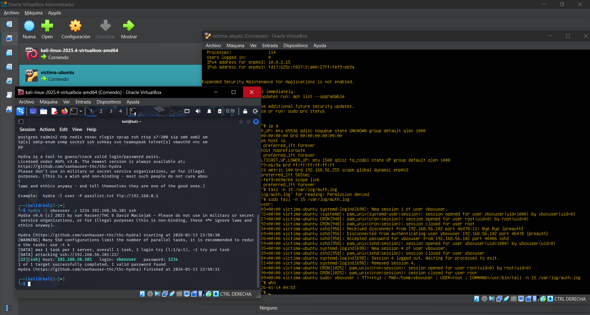
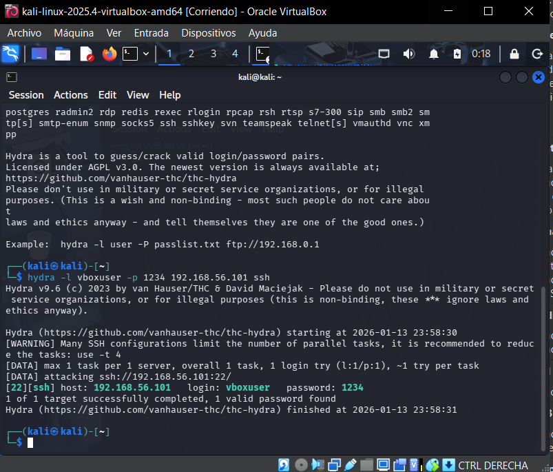
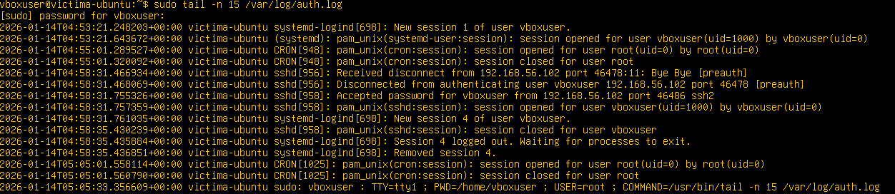
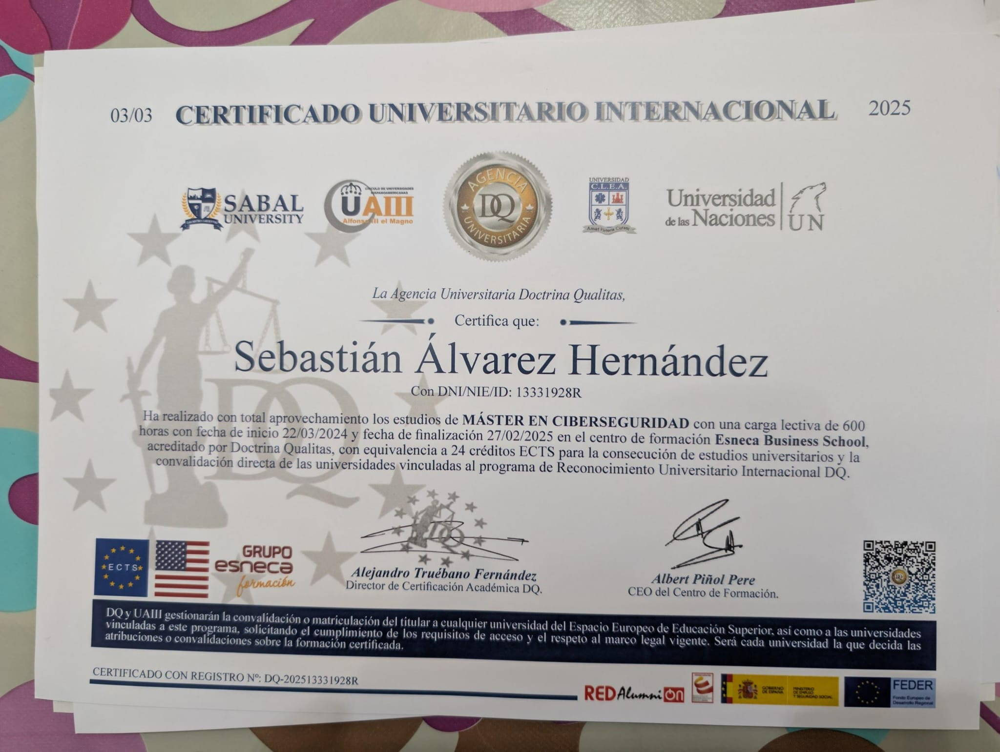

# SSH-Hardening-Lab
Laboratorio práctico de Pentesting (Hydra) y Hardening (Fail2Ban y Port Obfuscation) sobre Ubuntu Server, basado en mi formación de Máster en Ciberseguridad

#  SSH Security Lab: Pentesting & Hardening

###  Descripción
Este repositorio documenta un laboratorio práctico de ciberseguridad enfocado en la protección de servidores Linux. El proyecto abarca la explotación de vulnerabilidades (Fuerza Bruta), análisis forense y la implementación de defensas activas (Hardening).

###  Entorno Técnico
* **Atacante:** Kali Linux (Hydra)
* **Víctima:** Ubuntu Server 24.04
* **Defensa:** Fail2Ban & Port Obfuscation

---

##  Fase 1: Ataque de Fuerza Bruta (Pentesting)
**Objetivo:** Demostrar la vulnerabilidad de contraseñas débiles en servicios críticos.

### 1. Configuración del Laboratorio
Vista general del entorno virtualizado con las máquinas atacante y víctima en red interna.

### 2. Ejecución del Ataque
* **Comando:** `hydra -l vboxuser -p 1234 192.168.56.101 ssh`
* **Resultado:** Compromiso del sistema en <1 segundo.

### 3. Análisis Forense
* **Verificación:** Auditoría de `/var/log/auth.log` confirmando la intrusión.

---

##  Fase 2: Mitigación con Fail2Ban (Defensa Activa)
**Objetivo:** Automatizar la respuesta ante incidentes para bloquear atacantes en tiempo real.

* **Configuración:** Política de baneo tras 3 intentos fallidos.
* **Prueba:** Hydra recibe "Connection refused".
* **Evidencia:** La IP `192.168.56.102` aparece baneada.

---

##  Fase 3: Hardening (Ofuscación de Puertos)
**Objetivo:** Reducir la superficie de ataque cambiando el puerto estándar (22).

* **Acción:** Migración del servicio SSH al puerto **2222**.
* **Resultado:** Los escaneos al puerto 22 fallan; el acceso legítimo funciona por el 2222.

---

##  Certificación y Formación
Este laboratorio pone en práctica los conocimientos adquiridos en el **Máster en Ciberseguridad** (600 horas).

